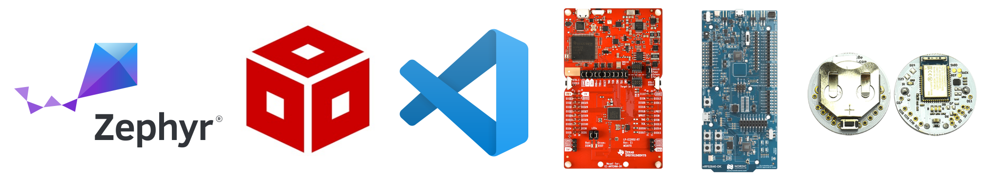
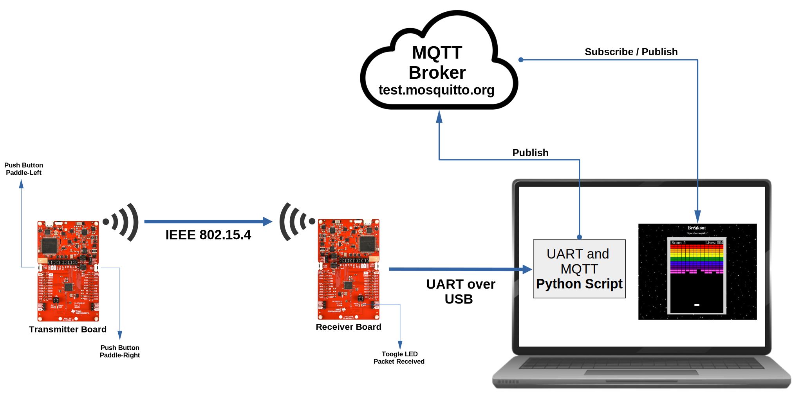
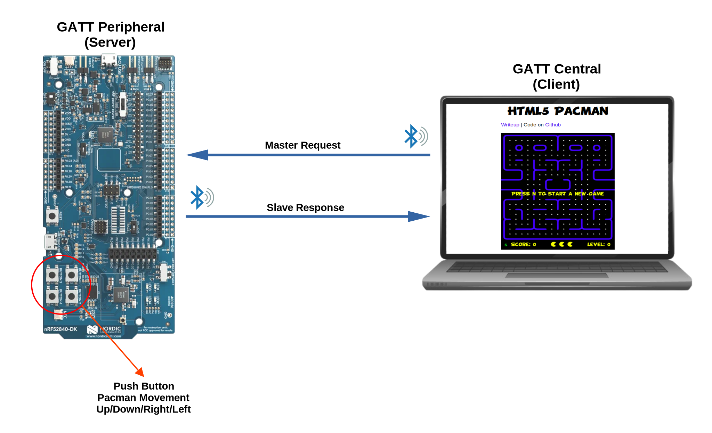
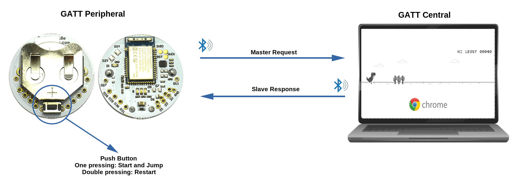

# Retro Game Night
<!-- #### Institut für Datentechnik und Kommunikationsnetze (IDA) -->
December 13, 2023  
\
 
$~~$

---

## Programming Tools

* Software 
    - Code Compser Studio IDE $~~~~~~~~~~~~~~~~~~~~~~~~~~$
    - Zephyr RTOS
    - Visual Studio Code 
    - Espruino WEB-IDE

---

## Programming Tools

* Hardware 
    - Launchpad CC26X2R1 **Texas Instruments**
    - nRF52840DK **Nordic Semiconductor**
    - Puck.js **Espruino**     

---

## Breakout Game Challenge

 

  Two launchpads will be wirelessly connected to simulate a remote control for playing a classic breakout game.

---

## Pong Game Challenge

 

  Two launchpads act as wireless controls, connected to a third that acts as a gateway.

---

## Pacman Game Challenge

 

 A nordic board will connect to a PC via the BLE protocol and GATT, creating a wireless controller for the game Pacman. 

---

## Chrome's Dino Challenge

 

 Espruino Puck.js board will be used to control the dinosaur jumping, starting and restarting in the Google Chrome game. 

---

### Before the start of the hackathon, form your work groups.

---

## It is time to start the hackathon !!!

 

Read the documentation in the repository, select the challenge, run the basic examples and build your own application.

